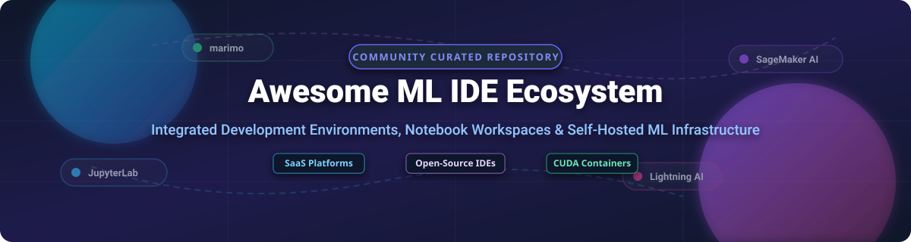

# Top Integrated Development Environments for Machine Learning (ML IDE) Ecosystem

**A Curated Ecosystem of Commercial SaaS Platforms & Open-Source GitHub Projects for Machine Learning Workspaces, Interactive Notebooks, and Self-Hosted AI Infrastructure.**

*Focused on Python Notebook IDEs, GPU-Accelerated Workspaces, MLOps Platforms, and Modular Developer Tooling.*

**Last Updated: October 2026**

---

## 📌 Overview & SEO Meta Summary

Machine Learning Integrated Development Environments (ML IDEs) bridge interactive experimentation and scalable production workflows. This repository tracks **commercial cloud platforms** and **open-source developer tools** designed for ML engineers, data scientists, and AI researchers. 

Whether you need managed cloud instances with auto-scaling GPUs (SageMaker AI, Vertex AI, Azure ML, Lightning AI), collaborative cloud notebooks (Hex, Deepnote, Domino Data Lab), or self-hosted open-source interactive IDEs (JupyterLab, code-server, marimo, Spyder), this guide provides clear comparisons on pricing, free tier limits, company valuation, and GitHub popularity.

---

## 📑 Table of Contents

- [SaaS & Managed Cloud Platforms](#saas--managed-cloud-platforms)
  - [Market Size & Sector Insights](#market-size--sector-insights)
  - [SaaS Platform Comparison Table](#saas-platform-comparison-table)
- [Open-Source GitHub Projects](#open-source-github-projects)
  - [Open-Source ML IDE & Notebook Table (Sorted by Stars)](#open-source-ml-ide--notebook-table-sorted-by-stars)
  - [Detailed Open-Source Tool Descriptions](#detailed-open-source-tool-descriptions)
- [Containerized & Docker ML Environments](#containerized--docker-ml-environments)
- [Frameworks for Building Custom ML IDEs](#frameworks-for-building-custom-ml-ides)
- [How to Contribute](#how-to-contribute)
- [Disclaimer & License Considerations](#disclaimer--license-considerations)

---

## SaaS & Managed Cloud Platforms

### Market Size & Sector Insights

> **Market Size & Sector Dynamics**: The global Machine Learning Development Platforms & Cloud Notebook IDE market is estimated at **$12.5 Billion in 2026** and projected to expand to **$45+ Billion by 2030** (CAGR ~31.8%). The sector is **moderately fragmented**: major cloud hyper-scalers (Google Cloud, Microsoft Azure, AWS) dominate infrastructure-heavy compute workloads, while specialized platforms (Lightning AI, Domino Data Lab, Hex, Deepnote) capture high market share in collaborative team UX, reactive execution, and multi-cloud flexibility.

### SaaS Platform Comparison Table

*(Sorted by Company Size / Valuation in Descending Order)*

| Platform / Product | Company Size / Valuation (Descending) | Specific Starting Price | Free Tier / Trial Limit | Key Strengths & Best For |
| :--- | :--- | :--- | :--- | :--- |
| **[Google Vertex AI Workbench](https://cloud.google.com/vertex-ai-workbench)** | **$4.20 Trillion** *(Alphabet Market Cap)* | **~$0.04 / hour** *(Compute Engine `n1-standard-1` VM instance)* | **$300 Free Credits** *(Valid for 90 days across GCP services)* | Managed Jupyter notebooks natively tied into GCP BigQuery, Vertex AI models, and Google Cloud security. |
| **[Azure Machine Learning Studio](https://azure.microsoft.com/en-us/products/machine-learning/)** | **$3.93 Trillion** *(Microsoft Market Cap)* | **~$0.096 / hour** *(Billed per compute instance e.g., `Standard_DS11_v2`)* | **$200 Free Credits** *(30-day trial + 12 months select free services)* | Enterprise ML workspace with Azure OpenAI integrations, drag-and-drop designer, and automated ML. |
| **[Amazon SageMaker Studio](https://aws.amazon.com/sagemaker/studio/)** | **$2.75 Trillion** *(Amazon Market Cap)* | **~$0.05 / hour** *(Billed per Studio `ml.t3.medium` notebook instance)* | **250 hours / month free** *(`ml.t3.medium` instance for first 2 months)* | Full lifecycle ML IDE with deep AWS IAM, S3 storage, model monitoring, and distributed training support. |
| **[Lightning AI Studio](https://lightning.ai/)** | **$2.50 Billion** *(Valuation post-merger, >$500M ARR)* | **$0.18 / hour** *(CPU Studios) / **$0.45 / hour** (T4 GPU Studios)* | **Free 24/7 CPU Studio** *(Auto-pause restart every 4h) + **$15/mo free GPU credits*** | Rapid PyTorch development, multi-GPU scaling, persistent studio storage, and instant app deployment. |
| **[Domino Data Lab Workbench](https://www.dominodatalab.com/)** | **~$915 Million** *(Estimated Valuation, >$50M ARR)* | **~$1,000 / month** *(Base enterprise platform starting tier quote)* | **14-day Free Trial** *(Access to sandbox environment & sample workloads)* | Enterprise MLOps workbench with strict governance, reproducible research, and regulated industry compliance. |
| **[Hex](https://hex.tech/)** | **$172 Million** *(Total Raised, ~$25M ARR estimated)* | **$36 / editor / month** *(Professional plan starting tier)* | **Free Community Plan** *(Up to 5 projects, 4GB RAM compute profile, basic AI actions)* | Collaborative data workspace uniting SQL, Python notebooks, interactive UI components, and published data apps. |
| **[Paperspace Gradient Notebooks](https://www.paperspace.com/gradient/notebooks)** | **$111 Million** *(Acquired by DigitalOcean, DOCN $3.2B Cap)* | **$8.00 / month** *(Pro plan base subscription + hourly GPU rate)* | **Free GPU/CPU Plan** *(Free Quadro M4000 GPU & CPU sessions, 6h auto-shutdown, 5GB storage)* | Affordable cloud GPUs and Jupyter-based notebooks optimized for indie developers, students, and startups. |
| **[Deepnote](https://deepnote.com/)** | **$96 Million** *(Post-money Series A valuation, ~$3.9M ARR)* | **$39 / editor / month** *(Team plan starting tier)* | **Free Forever Plan** *(Up to 3 editors, 5 active projects, 5GB RAM compute profile)* | Real-time collaborative cloud notebook with multi-user pairing, SQL integration, and automated scheduled runs. |
| **[Saturn Cloud](https://saturncloud.io/)** | **$10 Million ARR** *($4M seed funding raised)* | **$0.07 / hour** *(Standard CPU instance usage rate)* | **Free Tier** *(150 compute hours / month on standard CPU/GPU instances)* | Scalable Python compute platform tailored for parallel computing, Dask clusters, and large GPU workloads. |

---

## Open-Source GitHub Projects

### Open-Source ML IDE & Notebook Table (Sorted by Stars)

*(Sorted by GitHub Star Count in Descending Order)*

| Repository / Project | GitHub Star Badge (Links to Stargazers) | License | Environment Type | Primary Focus & Language |
| :--- | :--- | :--- | :--- | :--- |
| **[code-server](https://github.com/coder/code-server)** |  | MIT | Remote Web IDE | Runs VS Code in the browser on any remote server or Kubernetes cluster. |
| **[Apache Superset](https://github.com/apache/superset)** |  | Apache-2.0 | Data & SQL Lab | Data exploration workspace with SQL Lab notebook and rich interactive dashboards. |
| **[Streamlit](https://github.com/streamlit/streamlit)** |  | Apache-2.0 | App & ML UI IDE | Turns Python scripts into interactive ML applications and internal research tools. |
| **[Gradio](https://github.com/gradio-app/gradio)** |  | Apache-2.0 | ML Interface IDE | Rapidly creates web interfaces for machine learning models and LLM demos. |
| **[MLflow](https://github.com/mlflow/mlflow)** |  | Apache-2.0 | MLOps Platform | Open-source platform for managing the end-to-end ML lifecycle (tracking, registry, eval). |
| **[marimo](https://github.com/marimo-team/marimo)** |  | Apache-2.0 | Reactive Notebook | Next-generation reactive Python notebook stored as pure, executable `.py` files. |
| **[Coder](https://github.com/coder/coder)** |  | AGPL-3.0 | Dev Infrastructure | Provisions self-hosted development environments on your cloud via Terraform. |
| **[JupyterLab](https://github.com/jupyterlab/jupyterlab)** |  | BSD-3-Clause | Standard ML Notebook | De facto web-based interactive development environment for notebooks, code, and data. |
| **[Gitpod](https://github.com/gitpod-io/gitpod)** |  | AGPL-3.0 | Cloud Dev Environment | Automated dev environment platform that configures ready-to-code workspaces. |
| **[Jupyter Notebook](https://github.com/jupyter/notebook)** |  | BSD-3-Clause | Classic Notebook | The original, simple web application for creating and sharing computational documents. |
| **[Spyder IDE](https://github.com/spyder-ide/spyder)** |  | MIT | Desktop Scientific IDE | Python Scientific IDE with advanced editing, interactive inspection, and numerical computing. |
| **[Eclipse Che](https://github.com/eclipse-che/che)** |  | EPL-2.0 | Kubernetes IDE | Kubernetes-native cloud IDE and developer workspace manager. |
| **[Apache Zeppelin](https://github.com/apache/zeppelin)** |  | Apache-2.0 | Polyglot Notebook | Web-based notebook supporting data analytics, Spark, SQL, and multi-language backends. |
| **[OpenVSCode Server](https://github.com/gitpod-io/openvscode-server)** |  | MIT | Web IDE Server | Upstream VS Code server distribution for cloud-based remote development. |
| **[Quarto CLI](https://github.com/quarto-dev/quarto-cli)** |  | GPL-2.0 | Scientific Publishing | Open-source scientific publishing system built on Pandoc for Python, R, and Julia. |
| **[RStudio Desktop & Server](https://github.com/rstudio/rstudio)** |  | AGPL-3.0 | Statistical IDE | Premier integrated development environment for R, Python, and data science workflows. |
| **[Polynote](https://github.com/polynote/polynote)** |  | Apache-2.0 | Polyglot Notebook | Multi-language notebook framework (Scala, Python, SQL) with reproducible execution. |
| **[JupyterLab Desktop](https://github.com/jupyterlab/jupyterlab-desktop)** |  | BSD-3-Clause | Desktop App | Cross-platform desktop application bundling JupyterLab with embedded Python runtimes. |
| **[Beaker Notebook](https://github.com/twosigma/beaker-notebook)** |  | Apache-2.0 | Polyglot Notebook | Mixed-language research notebook allowing seamless data sharing across languages. |
| **[IDP (Intelligent Data Platform)](https://github.com/BaihaiAI/IDP)** |  | Apache-2.0 | AI Data IDE | Open-source AI IDE featuring a high-performance Rust kernel and Python/SQL support. |
| **[nteract](https://github.com/nteract/nteract)** |  | BSD-3-Clause | Desktop Notebook UI | Desktop application and SDKs for building interactive notebook user experiences. |

---

### Detailed Open-Source Tool Descriptions

- **[JupyterLab](https://github.com/jupyterlab/jupyterlab)** — The de facto standard for interactive computing. Supports over 100 programming languages through custom kernels. Features modular tabs, notebook cell execution, terminal integration, and full extensibility.
- **[marimo](https://github.com/marimo-team/marimo)** — Next-generation reactive notebook for Python. Guarantees reproducibility by running dependent cells automatically when variables change. Saved as pure, git-friendly `.py` scripts.
- **[code-server](https://github.com/coder/code-server)** — Runs VS Code on any remote Linux machine or container and renders it in the web browser. Gives developers full extension support and terminal access from anywhere.
- **[Spyder IDE](https://github.com/spyder-ide/spyder)** — Written in Python for Python, Spyder combines an advanced editor, interactive console, variable explorer, and graphical debugging tool built specifically for scientific computing.
- **[IDP (Intelligent Data Platform)](https://github.com/BaihaiAI/IDP)** — Open-source AI IDE with a kernel built in Rust for low latency and high execution throughput. Natively mixes Python, SQL, and Markdown within single notebook workflows.
- **[clawss](https://pypi.org/project/clawss/)** — Modular Python notebook environment with a browser-based IDE. Every cell behaves like a standalone `.py` module with isolated namespaces and cell dependency graph visualizations for PyTorch models.
- **[Polynote](https://github.com/polynote/polynote)** — Multi-language notebook developed by Netflix. Supports seamless variable sharing between Scala, Python, and SQL within the same notebook document.

---

## Containerized & Docker ML Environments

For reproducible local or cloud compute deployments, containerized development stacks package CUDA drivers, JupyterLab, and deep learning libraries out-of-the-box:

- **[amirhdallalan/ai-dev](https://hub.docker.com/r/amirhdallalan/ai-dev)** — Reusable CUDA 12.4 enabled AI/ML Docker container bundling PyTorch, Hugging Face Transformers, JupyterLab, code-server, OpenCV, FAISS, and MLflow.
- **[wordslab-notebooks](https://pypi.org/project/wordslab-notebooks-lib/)** — One-click AI environment installer combining Open WebUI, JupyterLab + Jupyter AI, VS Code server, Ollama, and vLLM inference engines.

---

## Frameworks for Building Custom ML IDEs

- **Foundational Engine**: Combine **JupyterLab** (`jupyterlab/jupyterlab`) or **marimo** (`marimo-team/marimo`) for core interactive notebook execution.
- **Remote Access Layer**: Deploy **code-server** (`coder/code-server`) or **OpenVSCode Server** for cloud-hosted IDE web interfaces.
- **Modular State Management**: Utilize **clawss** for cell dependency trees or **IDP** for Rust-powered multi-language execution.

---

## How to Contribute

1. Fork this repository.
2. Edit `README.md` maintaining table formats, specific pricing data, and valid GitHub links.
3. Ensure open-source additions include valid stargazers link badges.
4. Submit a Pull Request detailing your additions.

---

## Disclaimer & License Considerations

- **Community Curated**: This repository is a community-driven resource and does not constitute an endorsement of specific vendors.
- **Data Hardening**: Self-hosted and enterprise ML IDEs handle sensitive weights, data pipelines, and API keys. Verify security configurations before deployment.
- **Open-Source Licenses**: Licensing varies by project (BSD-3-Clause for Jupyter, Apache-2.0 for marimo/Superset, AGPL-3.0 for Coder/Gitpod, GPL-2.0 for Quarto). Always review license compatibility.

---

**Created for Machine Learning Engineers, Data Scientists, and AI Infrastructure Teams.**

